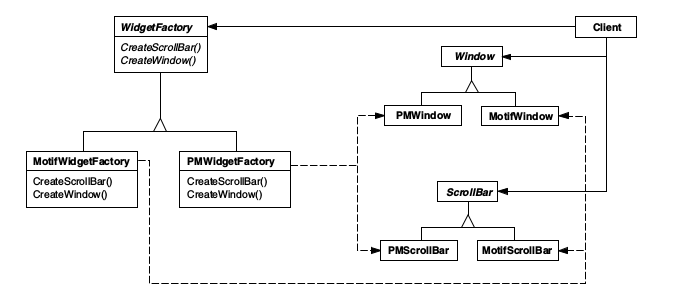

# Design Patterns

## Criacionais

Relacionados à criação de objetos.

### Abstract Factory
#### _Objetivo_:
Fornecer uma interface para criação de famílias de objetos relacionados ou dependen-
tes sem especificar suas classes concretas.

#### _Aplicabilidade_:
Use o abstract factory quando:

* um sistema deve ser independente de como seus produtos são criados, compostos ou representados;
* um sistema deve ser configurado como um produto como um produto de uma família de múltiplos produtos;
* uma família de objetos-produto for projetada para ser usada em conjunto, e você necessita garantir esta restrição;
* você quer fornecer uma biblioteca de classes de produtos e quer revelar somente suas interfaces, não suas implementações.

#### _Diagrama de Classes_:

### Builder
#### Objetivo:
#### Diagrama de Classes

### Factory Method

_Objetivo_: Encapsular a escolha da classe concreta a ser utilizada na criação de objetos de um determinado tipo.

_Diagrama de Classes_:

* Prototype
* Singleton
